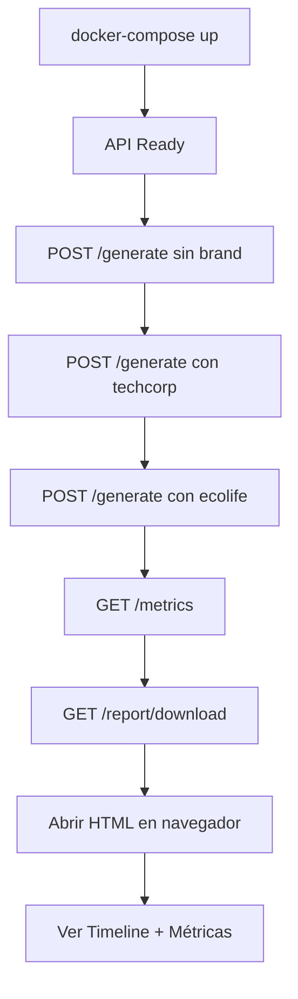

# 🐳 Guía Paso a Paso: Docker + API + HTML Reports

## 📋 Flujo Completo de Demostración con Docker

Esta guía te lleva paso a paso desde levantar Docker hasta generar y descargar reportes HTML.

---

## 🚀 PASO 1: Levantar el Entorno con Docker

```bash
# Desde el directorio raíz del proyecto
cd D:\Trabajo\Plinng\Marketing-Agent-Demo

# Levantar los servicios (FastAPI + ChromaDB)
docker-compose up -d

# Verificar que los contenedores están corriendo
docker-compose ps

# Deberías ver:
# NAME                          STATUS
# marketing-agent-demo-api      Up
# marketing-agent-demo-chromadb Up
```

**Verificar que la API está lista:**
```bash
# Esperar a que FastAPI esté listo (puede tomar 10-15 segundos)
curl http://localhost:8000/health
```

**Output esperado:**
```json
{
  "status": "healthy",
  "service": "marketing-agent",
  "environment": "development",
  "using_mock_model": true,
  "agent_mode": "multi-agent",
  "multi_agent_config": {
    "enabled": true,
    "critique_threshold": 8.0,
    "max_rewrites": 2
  }
}
```

---

## 🎯 PASO 2: Probar Endpoints Básicos

### 2.1 Ver Brands Disponibles

```bash
curl http://localhost:8000/brands
```

**Output esperado:**
```json
{
  "brands": [
    {
      "brand_id": "techcorp",
      "overview": "Leading technology company...",
      "guidelines_length": 2500,
      "available": true
    },
    {
      "brand_id": "ecolife",
      "overview": "Sustainable living brand...",
      "guidelines_length": 2300,
      "available": true
    },
    {
      "brand_id": "financewise",
      "overview": "Financial advisory services...",
      "guidelines_length": 2100,
      "available": true
    }
  ],
  "total": 3
}
```

### 2.2 Ver Información de un Brand Específico

```bash
curl http://localhost:8000/brands/techcorp
```

---

## 📝 PASO 3: Generar Posts - Escenarios Diferentes

### Escenario 1: Post SIN Brand Voice ⚡

```bash
curl -X POST http://localhost:8000/generate ^
  -H "Content-Type: application/json" ^
  -d "{\"topic\": \"The future of AI in software development\", \"tone\": \"professional\", \"max_length\": 500}"
```

**Qué sucede:**
- PlannerAgent crea un outline
- WriterAgent escribe el post
- CritiqueAgent evalúa (puede rechazar)
- WriterAgent reescribe si es necesario
- Se guarda en ChromaDB
- **TraceLogger captura todo el proceso**

**Output esperado (resumido):**
```json
{
  "post": {
    "id": "uuid-here",
    "topic": "The future of AI in software development",
    "content": "🚀 This is a mock-generated LinkedIn post...",
    "tone": "professional",
    "brand_id": null,
    "usage": {
      "prompt_tokens": 0,
      "completion_tokens": 0,
      "total_tokens": 0
    },
    "created_at": "2026-02-09T...",
    "metadata": {
      "workflow": "multi-agent",
      "iterations": 2,
      "final_score": 8.5,
      "workflow_summary": "[...]"
    }
  },
  "message": "Post generated successfully"
}
```

### Escenario 2: Post CON Brand Voice (TechCorp) 🏢

```bash
curl -X POST http://localhost:8000/generate ^
  -H "Content-Type: application/json" ^
  -d "{\"topic\": \"Cloud computing cost optimization strategies\", \"tone\": \"professional\", \"brand_id\": \"techcorp\"}"
```

**Qué sucede:**
- Se carga el brand voice de TechCorp desde `knowledge_base/techcorp_brand_voice.txt`
- Todos los agentes usan las guidelines de la marca
- CritiqueAgent valida adherencia a la marca
- El post sigue el estilo TechCorp

### Escenario 3: Post CON Brand Voice (EcoLife) 🌱

```bash
curl -X POST http://localhost:8000/generate ^
  -H "Content-Type: application/json" ^
  -d "{\"topic\": \"Sustainable packaging innovations for e-commerce\", \"tone\": \"inspirational\", \"brand_id\": \"ecolife\"}"
```

**Diferencias con TechCorp:**
- Tone más inspiracional
- Enfoque en sostenibilidad
- Hashtags específicos de EcoLife

### Escenario 4: Post Técnico (FinanceWise) 💰

```bash
curl -X POST http://localhost:8000/generate ^
  -H "Content-Type: application/json" ^
  -d "{\"topic\": \"Cryptocurrency investment strategies for 2026\", \"tone\": \"professional\", \"brand_id\": \"financewise\"}"
```

---

## 📊 PASO 4: Ver Métricas Acumuladas

```bash
curl http://localhost:8000/metrics
```

**Output esperado:**
```json
{
  "total_posts_generated": 4,
  "total_tokens_used": 0,
  "posts_by_brand": {
    "techcorp": 1,
    "ecolife": 1,
    "financewise": 1
  },
  "available_brands": 3,
  "status": "operational"
}
```

---

## 🎨 PASO 5: Generar y Descargar HTML Report

### 5.1 Descargar Report Como Archivo

```bash
# Descargar el reporte HTML
curl -o agent_report.html http://localhost:8000/report/download

# Verificar que se descargó
ls -la agent_report.html
```

### 5.2 Abrir el Report en el Navegador

**Windows:**
```bash
start agent_report.html
```

**Linux/Mac:**
```bash
xdg-open agent_report.html
# o
open agent_report.html
```

### 5.3 Obtener HTML como JSON (opcional)

```bash
curl http://localhost:8000/report/generate
```

**Output:**
```json
{
  "html": "<!DOCTYPE html>...",
  "message": "Report generated successfully"
}
```

---

## 📜 PASO 6: Ver Historial de Posts

```bash
# Ver últimos 10 posts
curl http://localhost:8000/history?limit=10

# Ver todos los posts
curl http://localhost:8000/history?limit=100
```

**Output:**
```json
{
  "posts": [
    {
      "id": "uuid-1",
      "topic": "The future of AI...",
      "content": "...",
      "brand_id": null,
      "created_at": "2026-02-09T..."
    },
    {
      "id": "uuid-2",
      "topic": "Cloud computing...",
      "content": "...",
      "brand_id": "techcorp",
      "created_at": "2026-02-09T..."
    }
  ],
  "total": 4
}
```

---

## 🔄 PASO 7: Workflow Completo - Demo End-to-End

### Script Completo (PowerShell)

```powershell
# 1. Levantar Docker
Write-Host "`n=== PASO 1: Levantando Docker ===" -ForegroundColor Cyan
docker-compose up -d
Start-Sleep -Seconds 15

# 2. Health Check
Write-Host "`n=== PASO 2: Health Check ===" -ForegroundColor Cyan
curl http://localhost:8000/health

# 3. Generar post sin brand
Write-Host "`n=== PASO 3: Post sin Brand ===" -ForegroundColor Cyan
curl -X POST http://localhost:8000/generate `
  -H "Content-Type: application/json" `
  -d '{"topic": "AI in healthcare", "tone": "professional"}'

Start-Sleep -Seconds 5

# 4. Generar post con TechCorp
Write-Host "`n=== PASO 4: Post con TechCorp Brand ===" -ForegroundColor Cyan
curl -X POST http://localhost:8000/generate `
  -H "Content-Type: application/json" `
  -d '{"topic": "Cloud security best practices", "tone": "professional", "brand_id": "techcorp"}'

Start-Sleep -Seconds 5

# 5. Generar post con EcoLife
Write-Host "`n=== PASO 5: Post con EcoLife Brand ===" -ForegroundColor Cyan
curl -X POST http://localhost:8000/generate `
  -H "Content-Type: application/json" `
  -d '{"topic": "Zero waste living tips", "tone": "inspirational", "brand_id": "ecolife"}'

Start-Sleep -Seconds 5

# 6. Ver métricas
Write-Host "`n=== PASO 6: Métricas ===" -ForegroundColor Cyan
curl http://localhost:8000/metrics

# 7. Descargar report
Write-Host "`n=== PASO 7: Descargando HTML Report ===" -ForegroundColor Cyan
curl -o agent_report.html http://localhost:8000/report/download

# 8. Abrir report
Write-Host "`n=== PASO 8: Abriendo Report en Navegador ===" -ForegroundColor Cyan
start agent_report.html

Write-Host "`n=== DEMO COMPLETADA ===" -ForegroundColor Green
Write-Host "Revisa el reporte HTML que se abrió en tu navegador`n"
```

**Guardar como:** `demo_docker_workflow.ps1`

**Ejecutar:**
```bash
.\demo_docker_workflow.ps1
```

---

## 🎬 Qué Verás en el HTML Report

### Header del Report:
```
┌────────────────────────────────────────────┐
│ 🤖 Agent Execution Report                 │
│                                            │
│ ⏱️ Tiempo: 12.5s | 📊 Pasos: 15          │
│ ✅ Éxito: 93.3%  | 💰 Costo: $0.015      │
│                                            │
│ 🎯 Resultado: ✅ APROBADO                 │
│    Score Final: 8.7/10                    │
│    Iteraciones: 2                         │
└────────────────────────────────────────────┘
```

### Timeline (ejemplo):
```
┌─────────────────────────────────────────────┐
│ [INFO] MultiAgentFlow                      │
│ Starting workflow...                        │
│ Topic: AI in healthcare                     │
│ Threshold: 8.0/10                          │
├─────────────────────────────────────────────┤
│ [✓] PlannerAgent | Planificación          │
│ Outline created:                            │
│ 1. Hook: AI revolution in healthcare...    │
│ ⏱️ 1.2s | 🎫 250 tokens                    │
├─────────────────────────────────────────────┤
│ [💭] WriterAgent | Generación             │
│ Post written based on outline...           │
│ ⏱️ 2.1s | 📏 487 chars                     │
├─────────────────────────────────────────────┤
│ [⚠] CritiqueAgent | Crítica               │
│ Score: 7.5/10 - REJECTED                   │
│ Feedback: Needs more specific examples...  │
│ ⏱️ 1.8s                                    │
├─────────────────────────────────────────────┤
│ [💭] WriterAgent | Reescritura            │
│ Addressing feedback...                      │
│ ⏱️ 2.3s | 📏 495 chars                     │
├─────────────────────────────────────────────┤
│ [✓] CritiqueAgent | Crítica               │
│ Score: 8.7/10 - APPROVED                   │
│ ⏱️ 1.9s                                    │
└─────────────────────────────────────────────┘
```

---

## 🛠️ PASO 8: Troubleshooting

### Si Docker no está corriendo:

```bash
# Ver logs
docker-compose logs -f api

# Reiniciar
docker-compose restart

# Rebuild (si hay cambios en código)
docker-compose up -d --build
```

### Si la API no responde:

```bash
# Ver estado
docker-compose ps

# Ver logs en tiempo real
docker-compose logs -f api

# Entrar al contenedor
docker exec -it marketing-agent-demo-api bash
```

### Si hay error en generación:

```bash
# Ver logs del último request
docker-compose logs --tail=50 api

# Verificar variables de entorno
docker exec marketing-agent-demo-api env | grep MULTI_AGENT
```

---

## 📊 PASO 9: Comparar Múltiples Reports

```bash
# Generar 3 posts con diferentes brands
curl -X POST http://localhost:8000/generate -H "Content-Type: application/json" -d "{\"topic\": \"Topic 1\", \"brand_id\": null}" -o response1.json

curl -o report1.html http://localhost:8000/report/download

curl -X POST http://localhost:8000/generate -H "Content-Type: application/json" -d "{\"topic\": \"Topic 2\", \"brand_id\": \"techcorp\"}" -o response2.json

curl -o report2.html http://localhost:8000/report/download

curl -X POST http://localhost:8000/generate -H "Content-Type: application/json" -d "{\"topic\": \"Topic 3\", \"brand_id\": \"ecolife\"}" -o response3.json

curl -o report3.html http://localhost:8000/report/download

# Abrir los 3 en el navegador
start report1.html
start report2.html
start report3.html
```

---

## 🎯 PASO 10: Limpiar

```bash
# Parar contenedores
docker-compose down

# Parar y eliminar volúmenes (borra ChromaDB data)
docker-compose down -v

# Ver archivos generados
ls *.html
ls *.json
```

---

## 📝 Resumen del Flujo



---

## ✅ Checklist de Demo

- [ ] Docker levantado (`docker-compose ps`)
- [ ] Health check OK (`curl /health`)
- [ ] Post sin brand generado
- [ ] Post con TechCorp generado
- [ ] Post con EcoLife generado
- [ ] Métricas vistas (`curl /metrics`)
- [ ] HTML report descargado
- [ ] HTML report abierto en navegador
- [ ] Timeline visible con pasos
- [ ] Métricas visibles en header

---

## 🚀 Comando Todo-en-Uno

```bash
# Demo completa automatizada
docker-compose up -d && `
  Start-Sleep 15 && `
  curl http://localhost:8000/health && `
  curl -X POST http://localhost:8000/generate -H "Content-Type: application/json" -d '{\"topic\":\"AI in healthcare\",\"brand_id\":\"techcorp\"}' && `
  Start-Sleep 5 && `
  curl -o report.html http://localhost:8000/report/download && `
  start report.html
```

**¡Este comando hace todo automáticamente!** 🎉

---

## 📸 Screenshots para la Demo

1. **Terminal**: Output de `docker-compose ps`
2. **Terminal**: Output de `curl /health` mostrando multi-agent mode
3. **Terminal**: Output de `curl /generate` con metadata de workflow
4. **Browser**: HTML report header con métricas
5. **Browser**: HTML report timeline con steps
6. **Browser**: HTML report step detail expandido

**¡Todo listo para demostrar el sistema completo con Docker!** 🐳🚀

